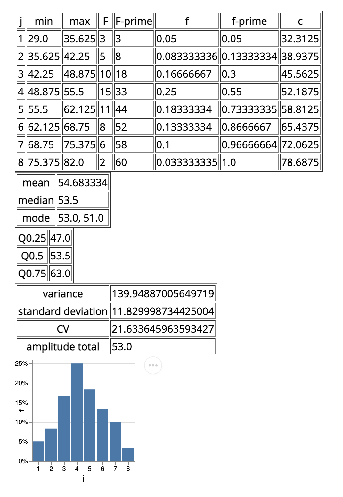

# dataviz

Some scripts and functions to ~~automate~~ _learn_ things from my statistics class

## Usage

Run the project directly to build and frequency distribution table:

    $ clj -M:run 3.12 3.18 3.21 3.22 3.22 3.25 3.26 3.28 3.13 3.19 3.21 3.22 3.23 3.25 3.26 3.28 3.14 3.19 3.21

This will produce something like this:

Build an uberjar:

    $ clojure -X:uberjar

This will update the generated `pom.xml` file to keep the dependencies synchronized with
your `deps.edn` file. You can update the version information in the `pom.xml` using the
`:version` argument:

    $ clojure -X:uberjar :version '"1.2.3"'

If you don't want the `pom.xml` file in your project, you can remove it, but you will
also need to remove `:sync-pom true` from the `deps.edn` file (in the `:exec-args` for `depstar`).

Run that uberjar:

    $ java -jar dataviz.jar

## License

Copyright © 2021 joaofnds

_EPLv1.0 is just the default for projects generated by `clj-new`: you are not_
_required to open source this project, nor are you required to use EPLv1.0!_
_Feel free to remove or change the `LICENSE` file and remove or update this_
_section of the `README.md` file!_

Distributed under the Eclipse Public License version 1.0.
